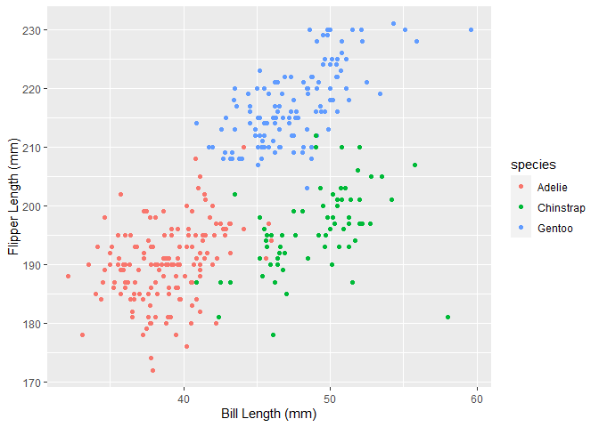

P8105 Homework 1
================
Shritama Ray
9/22/2022

## Problem 1

Load the **penguins** dataset:

``` r
data("penguins", package = "palmerpenguins")
```

Size of the dataset:

``` r
nrow(penguins)
```

    ## [1] 344

``` r
ncol(penguins)
```

    ## [1] 8

Descriptive Statistics:

``` r
summary(penguins)
```

    ##       species          island    bill_length_mm  bill_depth_mm  
    ##  Adelie   :152   Biscoe   :168   Min.   :32.10   Min.   :13.10  
    ##  Chinstrap: 68   Dream    :124   1st Qu.:39.23   1st Qu.:15.60  
    ##  Gentoo   :124   Torgersen: 52   Median :44.45   Median :17.30  
    ##                                  Mean   :43.92   Mean   :17.15  
    ##                                  3rd Qu.:48.50   3rd Qu.:18.70  
    ##                                  Max.   :59.60   Max.   :21.50  
    ##                                  NA's   :2       NA's   :2      
    ##  flipper_length_mm  body_mass_g       sex           year     
    ##  Min.   :172.0     Min.   :2700   female:165   Min.   :2007  
    ##  1st Qu.:190.0     1st Qu.:3550   male  :168   1st Qu.:2007  
    ##  Median :197.0     Median :4050   NA's  : 11   Median :2008  
    ##  Mean   :200.9     Mean   :4202                Mean   :2008  
    ##  3rd Qu.:213.0     3rd Qu.:4750                3rd Qu.:2009  
    ##  Max.   :231.0     Max.   :6300                Max.   :2009  
    ##  NA's   :2         NA's   :2

**Discussion:** This dataset consists of a 344 row x 8 column tibble.
The variables are species, island, bill_length_mm, bill_depth_mm,
flipper_length_mm, body_mass_g, sex, and year. There are **3 species**
of penguins represented, across **3 islands.** The mean flipper length
of the penguins is **200.9 mm.**

**Scatterplot of flipper length vs. bill length**

``` r
#Load tidyverse library
```

``` r
library(tidyverse)
```

    ## ── Attaching packages ─────────────────────────────────────── tidyverse 1.3.2 ──
    ## ✔ ggplot2 3.3.6      ✔ purrr   0.3.4 
    ## ✔ tibble  3.1.8      ✔ dplyr   1.0.10
    ## ✔ tidyr   1.2.0      ✔ stringr 1.4.1 
    ## ✔ readr   2.1.2      ✔ forcats 0.5.2 
    ## ── Conflicts ────────────────────────────────────────── tidyverse_conflicts() ──
    ## ✖ dplyr::filter() masks stats::filter()
    ## ✖ dplyr::lag()    masks stats::lag()

``` r
#Create scatter plot colored by species
ggplot(penguins, aes(x = bill_length_mm, y = flipper_length_mm, color = species)) + geom_point()+ xlab("Bill Length (mm)") + ylab("Flipper Length (mm)")
```

<!-- -->

``` r
#Save plot
ggsave("penguins_scatter.pdf", height = 4, width = 6)
```

## Problem 2

**Create a data frame:**

``` r
#dataframe named 'problem2'
problem2 = tibble(
  # random sample of size 10 from standard normal distribution
  vec_rand_10 = rnorm(10, mean = 0, sd = 1),
  # logical vector indication whether sample elements are > 0 
  vec_logical = vec_rand_10 > 0,
  # character vector of length 10
  vec_char = character(10),
  # factor vector of length 10 with 3 factor levels
  vec_factor = factor(c("L1", "L2", "L3", "L3","L3","L1","L3", "L2", "L1", "L1"))
)
```

**Try to take the mean of each variable in the dataframe:**

``` r
mean(pull(problem2,vec_rand_10))
```

    ## [1] 0.4029201

That works!

``` r
mean(pull(problem2,vec_logical))
```

    ## [1] 0.7

That works too!

``` r
mean(pull(problem2,vec_char))
```

    ## Warning in mean.default(pull(problem2, vec_char)): argument is not numeric or
    ## logical: returning NA

    ## [1] NA

That doesn’t work :(

``` r
mean(pull(problem2,vec_factor))
```

    ## Warning in mean.default(pull(problem2, vec_factor)): argument is not numeric or
    ## logical: returning NA

    ## [1] NA

That doesn’t work either :(
